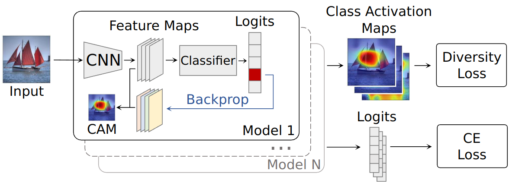
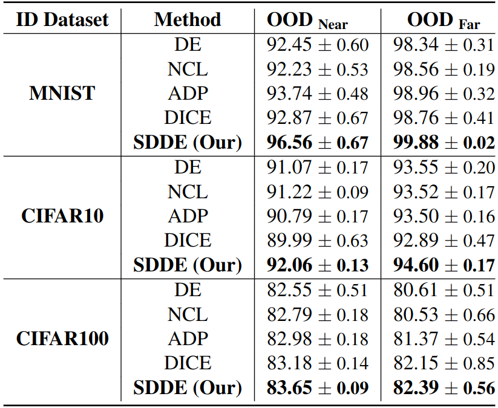

# Ensemble diversity for OOD detection

Official implementation of [Diversifying Deep Ensembles: A Saliency Map Approach for Enhanced OOD Detection, Calibration, and Accuracy](https://arxiv.org/abs/2305.11616) paper by Stanislav Dereka, Ivan Karpukhin, Maksim Zhdanov, and Sergey Kolesnikov.

**[2024-06-07]** The paper is accepted to [IEEE ICIP 2024](https://2024.ieeeicip.org/) conference

<p align="center">
    
</p>

The implementation of training pipelines is based on [OpenOOD](https://github.com/Jingkang50/OpenOOD).

## Using SDDE loss function

If you want to use SDDE loss function without reproducing
any of the paper results, install `sdde` package:

```shell
pip install .
```

Next, you can use all the implemented diversity loss functions in your code:

```python
from sdde import ADPDiversityLoss, DiceDiversityLoss, \
    GradCAMDiversityLoss, InputGradientDiversityLoss, \
    NCLDiversityLoss, OEDiversityLoss

loss_function = GradCAMDiversityLoss()

# N - number of ensemble models
# B - batch size
# L - number of classes
# C, H, W - image or featuremap dimensions

loss = loss_function(
    labels=..., # (B)
    logits=..., # (N, B, L)
    feature_maps=..., # (N, B, C, H, W) 
    features=None,
    images=None
)
```

## Preparing the environment

1. Build Docker image from `./Dockerfile`.
2. Alternatively, you can build Miniconda environment from `./environment.yml`.
3. Download the datasets:
```shell
bash ./scripts/download/download.sh
```

**Note.** If some links in `download.sh` are broken, 
download the datasets by yourself from the official
repositories and refer to `./scripts/imglist_generator.py`
to prepare image lists in OpenOOD format.

## Reproducing the results

As we use [wandb](https://wandb.ai/) as a monitoring tool, you need to set wandb environment variables:

```shell
export WANDB_API_KEY=<YOUR_KEY>
export WANDB_ENTITY=<YOUR_ENTITY>
```

**Note**: run all the scripts below from the repository root.

**Note**: all the experiments on `cifar10`, `cifar100`, `mnist` are guaranteed to run on a single Nvidia A100 GPU. For ImageNet-1K we use a setup of 8 NVIDIA A100.

### Saliency-diversified Deep Ensemble (SDDE)

Run the following command:
```shell
bash scripts/uni/<METHOD>/<DATASET>_multiseed.sh
```

Where METHOD should be in `de`, `nlc`, `adp`, `dice`, `gradcam` (SDDE, ours); DATASET in
`cifar10`, `cifar100`, `mnist`, `imagenet`. This will run training, OOD evaluation, and calibration pipelines.

The results will appear in wandb.

<p align="center">
    
</p>

### SDDE with OOD data

To run SDDE<sub>OOD</sub> use the scripts in `scripts/uni/gradcam-oe`.
For outlier exposure (OE) baseline, see `scripts/uni/oe`.

## Citing

Please, use the following BibTex citation:

```
@article{dereka2023diversifying,
  title={Diversifying Deep Ensembles: A Saliency Map Approach for Enhanced OOD Detection, Calibration, and Accuracy},
  author={Dereka, Stanislav and Karpukhin, Ivan and Zhdanov, Maksim and Kolesnikov, Sergey},
  journal={arXiv preprint arXiv:2305.11616},
  year={2023}
}
```
